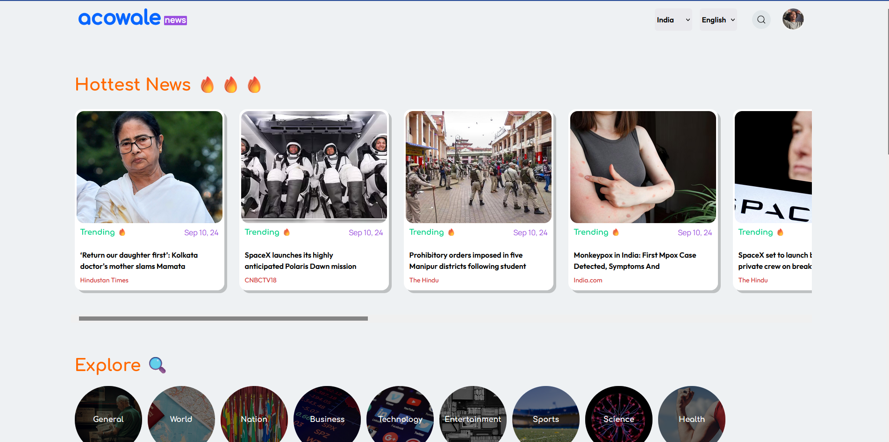
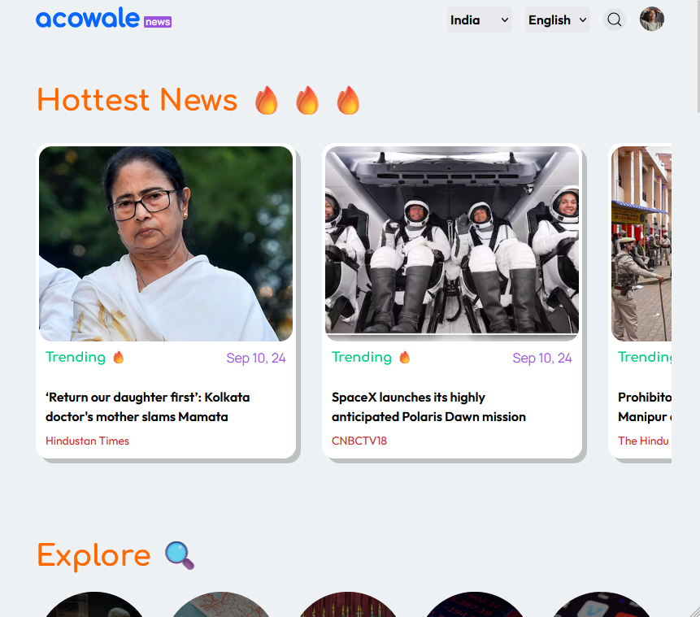
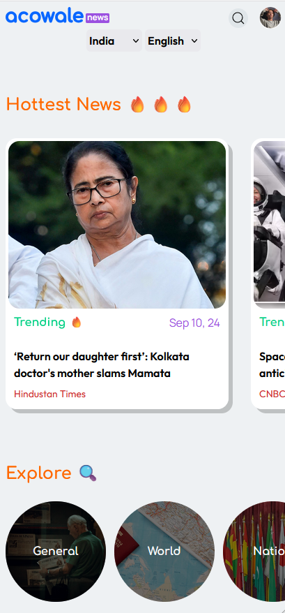

# Aconews

## Screenshots

## Table of contents

- [Overview](#overview)
  - [About](#about)
  - [Features](#features)
  - [Problems](#problems)
  - [Links](#links)
- [Resources](#resources)
  - [API](#api)
  - [Dependencies](#dependencies)
  - [References](#references)
- [Future-plans](#future-plans)

---

## Overview

Aconews is a minimalist news feed app created with React and Node/express.

### About

I have used Vite for instant React project creation, TailwindCSS for styling, React-router for basic single-page routing, and Node.js with Express.js for creating backend service for managing gnews APIs. I have used Acowale's official site for getting typography, colors, fonts, and styling references. I have chosen a mobile-first approach for responsive layouts which is also compatible with all screens thanks to tailwind responsive design classes. First I have created responsive layouts with dummy data and implemented routes and skeleton loading for loading behavior.

I have created a home page that shows trending articles, category filters, and a news feed, created a search component for getting debounced results of news articles, and created filters for choosing country and language/region-specific news, Users can choose news categories for getting related news.

For the implementation of the backend services, I have to use Vercel for hosting, Express.js framework as a dependency. Created different router files for creating two endpoints i.e. fetchTrendingNews and fetchSearchNews. For implementing these endpoints I have used promises, try-catch, async-await block, and used Axios to fetch data from gnews API.

### Features

- Trending and news feed section,
- Filter news by Language, category and country,
- Search component for getting latest news feed by keywords,
- Pagination based on categories(API doesn't).

### Problems

Two minor issues I have faced are with Firebase because free plans don't support Firebase functions and app hosting also API doesn't support pagination for free tier.

### Links

- Vercel URL: [https://mrrobotaconews.vercel.app/]

---

## Resources

### API

- `gnews.io`: For getting short list of news feeds and simple description data,

### Dependencies

- TailwindCSS `v3.4.10`,
- React-router `v6.26.1`,
- React-loading-skeleton `v3.4.0`,
- Axios `v1.7.7`,
- express `v4.19.2`,

### References

- **[MDN](https://developers.mozilla.org)** - Everything WEB.
- **[react.dev](https://react.dev)** - Everything React.
- **[tailwindCSS](https://tailwindcss.com)** - Everything CSS
- **[javascript.info](https://javascript.info)** - Everything JavaScript.
- **[CSSTricks](https://css-tricks.com)** - Everything CSS tutorials.

---

## Future-plans

- Animations using framer motion
- More api's for getting more kinds of data
- Redux for storing data within the project
- TanStack Query replacing axios
- GraphQL for fetching and managing API related queries
